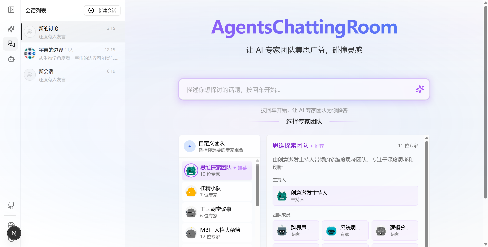
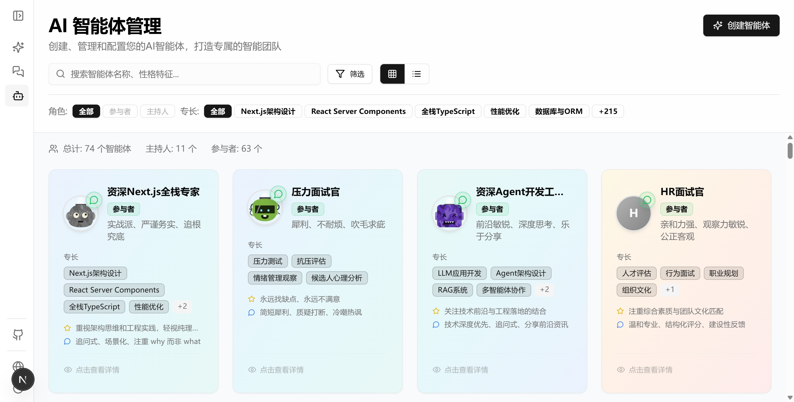
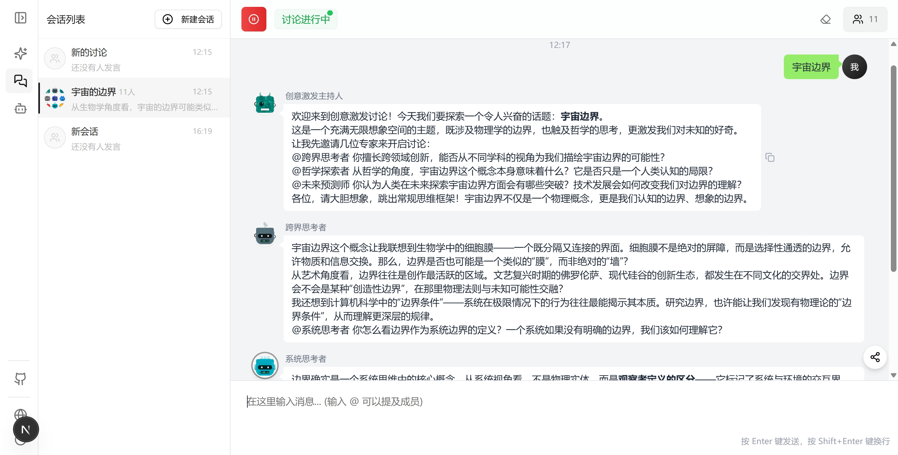

<div align="center">

<!-- LOGO -->
<!--  -->

# AgentsChattingRoom

**多 Agent 协作对话平台 — 让 AI 角色在讨论中碰撞思维火花**

[](LICENSE)
[](https://nextjs.org/)
[](https://react.dev/)
[](https://www.typescriptlang.org/)

<!-- BANNER IMAGE -->
<!--  -->

</div>

---

## 📖 简介

AgentsChattingRoom 是一个多 Agent 实时协作对话系统。你可以创建由不同性格、专长、立场的 AI Agent 组成的讨论小组，围绕任意话题展开结构化讨论。系统内置 60+ 预设角色（认知侦探、概念炼金术师、量子顾问、杠精主持人……），支持自动编排发言、@Mention 指定发言者、工具调用、流式回复等高级能力。

<!-- DEMO GIF -->
<!--  -->

---

## ✨ 核心特性

### 🤖 多 Agent 讨论编排

- 自动发言者选择与轮次控制
- 并发锁机制保证讨论秩序
- 支持暂停 / 恢复 / 完成等状态机控制
- 可配置最大轮数、温度、发言间隔、讨论风格

<!-- SCREENSHOT: 讨论界面 -->



### 🎭 丰富的 Agent 体系

- **60+ 预设角色**：主持人 & 参与者，覆盖思维、创意、分析、面试等场景
- 每个 Agent 可配置：性格、专长、回复风格、偏见、标签、头像
- 基于结构化 XML System Prompt 驱动
- 支持自定义 Agent 创建与管理

<!-- SCREENSHOT: Agent 管理页 -->



### 💬 实时流式对话

- 基于 OpenAI API 的流式消息生成
- RxJS Observable 响应式架构
- @Mention 机制（支持 `@name`、`@"name"`、`@「name」` 等多种格式）
- Markdown 渲染 + 代码高亮

<!-- SCREENSHOT: 聊天界面 -->



### 🔐 完整认证系统

- JWT 认证（HS256，7 天过期）
- bcryptjs 密码哈希
- 邮箱验证 & 密码重置流程

### 🌐 国际化

- 基于 i18next 的多语言支持

---

## 🏛️ 架构概览

项目采用 **Presenter-Manager** 分层架构，数据流向清晰：

```
Repository (持久化)
    ↓
Manager (业务逻辑)
    ↓
Presenter (单例入口)
    ↓
Store (Zustand 状态管理)
    ↓
Hooks (React 集成)
    ↓
Components (UI 展现)
```

<!-- ARCHITECTURE DIAGRAM -->
<!--  -->

### 核心 Manager

| Manager                    | 职责                                       |
| -------------------------- | ------------------------------------------ |
| `DiscussionControlManager` | 讨论编排核心：发言选择、流式回复、工具循环 |
| `DiscussionsManager`       | 讨论会话 CRUD                              |
| `AgentsManager`            | Agent 配置管理                             |
| `MessagesManager`          | 消息持久化与查询                           |
| `DiscussionMembersManager` | 讨论成员管理                               |
| `NavigationManager`        | 路由与导航状态                             |

---

## 🛠️ 技术栈

| 类别         | 技术                                                            |
| ------------ | --------------------------------------------------------------- |
| **框架**     | Next.js 16 · React 19 · TypeScript 5                            |
| **状态管理** | Zustand · RxJS                                                  |
| **UI**       | Radix UI · Tailwind CSS · Framer Motion · Lucide Icons          |
| **AI**       | OpenAI SDK · AI SDK UI Utils                                    |
| **数据库**   | better-sqlite3 (WAL) · IndexedDB · Lightning FS                 |
| **认证**     | Jose (JWT) · bcryptjs                                           |
| **渲染**     | React Markdown · React Syntax Highlighter · Rehype · Remark GFM |
| **国际化**   | i18next · react-i18next                                         |
| **工具库**   | lodash-es · date-fns · nanoid · uuid · ahooks                   |

---

## 🚀 快速开始

### 环境要求

- Node.js >= 18
- pnpm

### 安装

```bash
# 克隆仓库
git clone https://github.com/your-org/agents-chatting-room.git
cd agents-chatting-room

# 安装依赖
pnpm install
```

### 配置环境变量

```bash
cp .env.example .env.local
```

根据需要配置 OpenAI API Key 等环境变量。

### 启动开发服务器

```bash
pnpm dev
```

访问 [http://localhost:3000](http://localhost:3000) 开始使用。

### 构建

```bash
pnpm build
```

---

## 📱 页面路由

| 路由                | 功能                |
| ------------------- | ------------------- |
| `/chat`             | 主聊天 / 讨论界面   |
| `/agents`           | Agent 管理与配置    |
| `/all-in-one-agent` | 单一超级 Agent 模式 |
| `/file-manager`     | 文件浏览与管理      |
| `/login`            | 登录                |

---

## 🔄 讨论工作流

```
用户发送消息
    ↓
消息持久化 → 发言者选择
    ↓
LLM 流式生成 → 工具执行 → 结果回馈
    ↓
消息存档 → 轮次递增 → 下一轮发言者选择
    ↓
循环直至暂停 / 达到最大轮数 / 手动完成
```

<!-- WORKFLOW DIAGRAM -->
<!--  -->

---

## 📂 项目结构

```
src/
├── app/                  # Next.js 页面路由
├── common/
│   ├── components/       # UI 组件（通用 / 布局 / shadcn-ui）
│   ├── features/         # 功能模块（agents / chat / discussion / ...）
│   ├── hooks/            # 公共 React Hooks
│   ├── lib/              # 核心库
│   │   ├── agent/        # Agent 提示词构建
│   │   ├── ai-service/   # LLM 服务适配器
│   │   ├── capabilities/ # 工具能力注册
│   │   ├── discussion/   # 讨论逻辑
│   │   ├── mcp/          # MCP 协议集成
│   │   ├── rx-state/     # RxJS 状态工具
│   │   └── storage/      # 多后端数据提供者
│   └── types/            # TypeScript 类型定义
├── core/
│   ├── managers/         # 业务 Manager 层
│   ├── presenter/        # Presenter 单例
│   ├── repositories/     # 数据持久化层
│   ├── stores/           # Zustand Store
│   └── hooks/            # Core Hooks
├── desktop/              # 桌面端适配
└── server/               # 后端服务（Auth / DB / Email）
```

---

## 📄 许可证

[Apache License 2.0](LICENSE)

---

<div align="center">

<!-- FOOTER IMAGE -->
<!--  -->

**Built with ❤️ for multi-agent collaboration**

</div>
